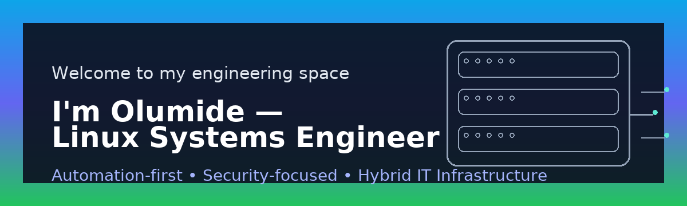

  

  <em>Automation-first • Security-focused • Hybrid IT Infrastructure</em>

  

  
  
  

---

# 👋 Hi, I’m Olumide

Linux Systems Engineer | RHCE | Ansible | VMware | Home Lab Enthusiast

- **Automation-first** (Ansible, CI/CD)
- **Secure Linux** (RBAC, ACLs, monitoring, compliance)
- **Hybrid integration** (AD ↔ Linux, DNS, NFS)

## 🚀 Featured
- https://github.com/lummidizzle/homelab-infrastructure-projects

## 📫 Connect
- LinkedIn: https://www.linkedin.com/in/lummyd
- Email: olumyfam@gmail.com

